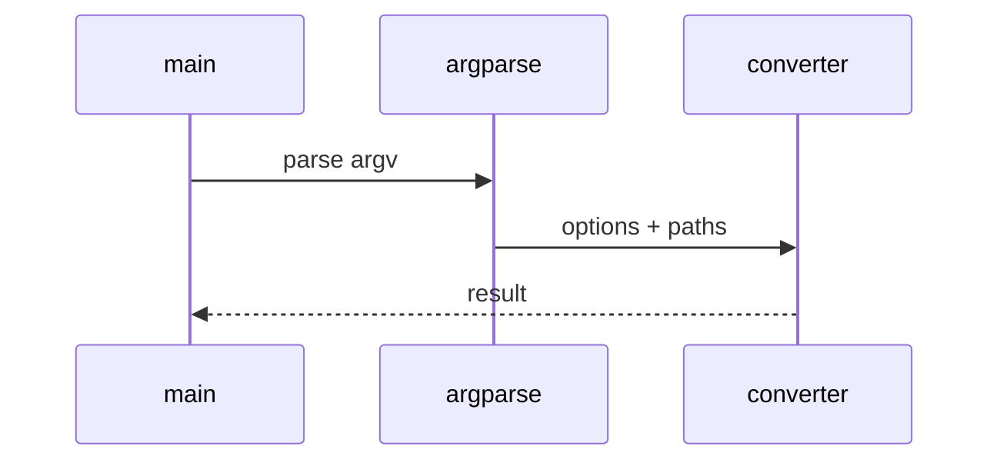

# ZIP Archive Low-Level Design

## Class and module responsibilities

| Symbol | Responsibility |
|--------|----------------|
| `convert_archive` | Public entry / orchestration |
| `convert_zip` | Public entry / orchestration |
| `extract_archive` | Public entry / orchestration |

## Call sequence (CLI)

## File map

| Path | Role |
|------|------|
| `src\md_generator\archive\__init__.py` | Implementation |
| `src\md_generator\archive\api\__init__.py` | Implementation |
| `src\md_generator\archive\api\convert_runner.py` | Implementation |
| `src\md_generator\archive\api\jobs.py` | Implementation |
| `src\md_generator\archive\api\main.py` | Implementation |
| `src\md_generator\archive\api\mcp_server.py` | Implementation |
| `src\md_generator\archive\api\mcp_setup.py` | Implementation |
| `src\md_generator\archive\api\query_options.py` | Implementation |
| `src\md_generator\archive\api\settings.py` | Implementation |
| `src\md_generator\archive\convert_impl.py` | Implementation |
| `src\md_generator\archive\converter.py` | Implementation |
| `src\md_generator\archive\extractors.py` | Implementation |
| ... | (13 Python files total) |

