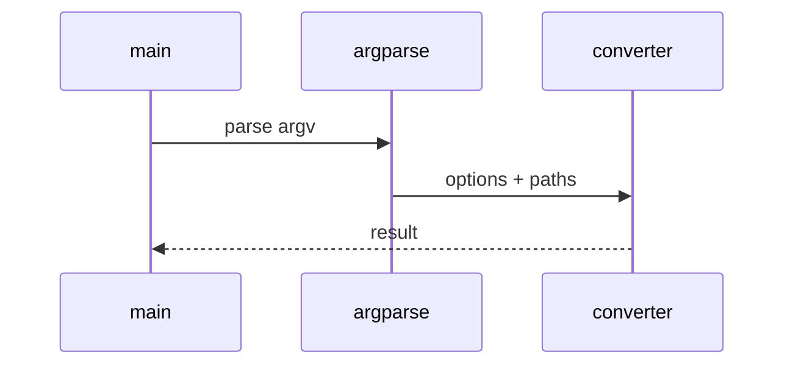

# Codeflow Low-Level Design

## Class and module responsibilities

| Symbol | Responsibility |
|--------|----------------|
| `run_scan` | Public entry / orchestration |
| `ScanConfig` | Public entry / orchestration |
| `build_output_zip` | Public entry / orchestration |
| `build_graph` | Public entry / orchestration |

## Call sequence (CLI)

## File map

| Path | Role |
|------|------|
| `src\md_generator\codeflow\__init__.py` | Implementation |
| `src\md_generator\codeflow\analyzers\__init__.py` | Implementation |
| `src\md_generator\codeflow\analyzers\flow_analyzer.py` | Implementation |
| `src\md_generator\codeflow\api\__init__.py` | Implementation |
| `src\md_generator\codeflow\api\job_manager.py` | Implementation |
| `src\md_generator\codeflow\api\main.py` | Implementation |
| `src\md_generator\codeflow\api\mcp_server.py` | Implementation |
| `src\md_generator\codeflow\api\run.py` | Implementation |
| `src\md_generator\codeflow\api\schemas.py` | Implementation |
| `src\md_generator\codeflow\api\semantic_api.py` | Implementation |
| `src\md_generator\codeflow\api\settings.py` | Implementation |
| `src\md_generator\codeflow\api\sse.py` | Implementation |
| ... | (111 Python files total) |

Language parsers under `codeflow/parsers/` and optional tree-sitter adapters.
