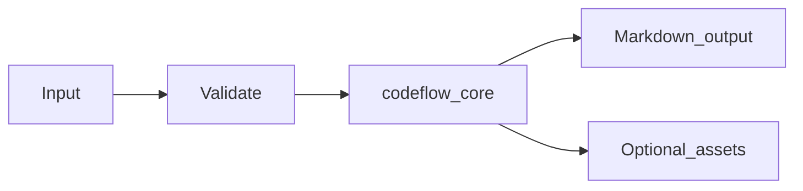

# Codeflow Module Overview

## Purpose

The **Codeflow** module (`md_generator.codeflow`) converts **Source repositories** into **Architecture Markdown, graphs, flow docs, JSON, Mermaid**. It exists so teams can publish searchable, diff-friendly Markdown from operational inputs without maintaining separate documentation pipelines per format.

## Problem solved

- Manual copy/paste from Source repositories into wikis does not scale.
- Downstream AI/RAG workflows need stable text and asset bundles.
- CI and gateways need a consistent CLI/API surface across `mdengine` modules.

## When to use

- You need repeatable Markdown export from Source repositories.
- You want CLI automation, HTTP conversion, or MCP tool integration (where implemented).
- You can install the `codeflow` optional extra (and `api` for HTTP services).

## When not to use

- Inputs fall outside supported formats or size limits enforced by the module.
- You require authenticated multi-tenant SaaS features (not provided by this module; use gateway auth).
- You need transactional writes into application databases (this module documents or transforms; it does not own app schemas except metadata export modules).

## Package facts

| Item | Value |
|------|-------|
| Import path | `md_generator.codeflow` |
| Source tree | `src/md_generator/codeflow` |
| CLI | `md-codeflow` |
- Alternate entry: `codeflow / mdengine codeflow-to-md scan`
| PyPI extra | `codeflow` |
| Complexity tier | `complex` |
| API service name | `codeflow-to-md` |

## Primary entry points

- `run_scan`
- `ScanConfig`
- `build_output_zip`
- `build_graph`

## Deep documentation

- [graph-and-outputs.md](https://github.com/vishal7090/md-generator/blob/main/codeflow-to-md/docs/graph-and-outputs.md)
- [remote-repos.md](https://github.com/vishal7090/md-generator/blob/main/codeflow-to-md/docs/remote-repos.md)
- [cache-and-semantic.md](https://github.com/vishal7090/md-generator/blob/main/codeflow-to-md/docs/cache-and-semantic.md)

