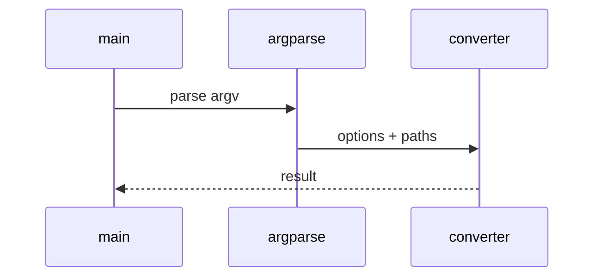

# Database Metadata Low-Level Design

## Class and module responsibilities

| Symbol | Responsibility |
|--------|----------------|
| `extract_to_markdown` | Public entry / orchestration |
| `create_adapter` | Public entry / orchestration |
| `RunConfig` | Public entry / orchestration |
| `JobManager` | Public entry / orchestration |
| `export_elasticsearch_markdown` | Public entry / orchestration |

## Call sequence (CLI)

## File map

| Path | Role |
|------|------|
| `src\md_generator\db\__init__.py` | Implementation |
| `src\md_generator\db\adapters\__init__.py` | Implementation |
| `src\md_generator\db\adapters\access_adapter.py` | Implementation |
| `src\md_generator\db\adapters\access_introspect.py` | Implementation |
| `src\md_generator\db\adapters\access_odbc.py` | Implementation |
| `src\md_generator\db\adapters\elasticsearch_adapter.py` | Implementation |
| `src\md_generator\db\adapters\elasticsearch_json_adapter.py` | Implementation |
| `src\md_generator\db\adapters\factory.py` | Implementation |
| `src\md_generator\db\adapters\mongo_adapter.py` | Implementation |
| `src\md_generator\db\adapters\mysql_adapter.py` | Implementation |
| `src\md_generator\db\adapters\oracle_adapter.py` | Implementation |
| `src\md_generator\db\adapters\postgres_adapter.py` | Implementation |
| ... | (64 Python files total) |

Database adapters in `db/adapters/` (factory pattern). Elasticsearch via `--type elasticsearch` or bundle upload to `/db-to-md/run/elasticsearch`.
