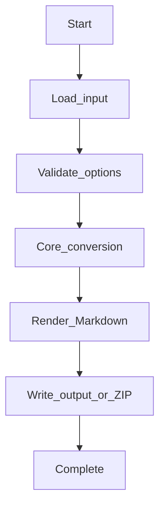
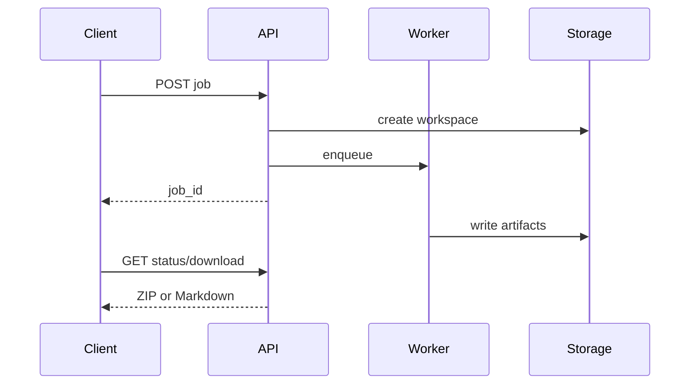

# Database Metadata Workflows

## CLI workflow

1. Install `mdengine[db]`.
2. Run `md-db --help` to list flags.
3. Provide input (Postgres, MySQL, Oracle, SQLite, Mongo, Access, Elasticsearch/OpenSearch clusters and offline JSON bundles) and output path.
4. Inspect generated Markdown and sidecar assets.

## API workflow

1. Install `mdengine[db,api]`.
2. Start uvicorn on `md_generator.db` API module (see Deployment).
3. Call sync endpoint for small payloads or job endpoint for large conversions.
4. Poll job status and download artifact when complete.

## Processing pipeline

## Async job flow

Where job routes exist, background work uses in-process threads or domain job managers; results land in job workspace + download.

## Elasticsearch / OpenSearch export

1. **Live cluster** — `--type elasticsearch` with cluster URI (or YAML `database.type: elasticsearch`).
2. **Offline bundle** — POST a ZIP of exported cluster JSON to `/db-to-md/run/elasticsearch` (sync) or `/db-to-md/job/elasticsearch` (async).
3. Enable feature flags such as `elasticsearch_indices`, `elasticsearch_search_templates`, `elasticsearch_search_dependency_graph` via `--include`.

Output lands under `elasticsearch/` (indices, templates, pipelines, ILM, search templates, alias graph, dependency graph).

