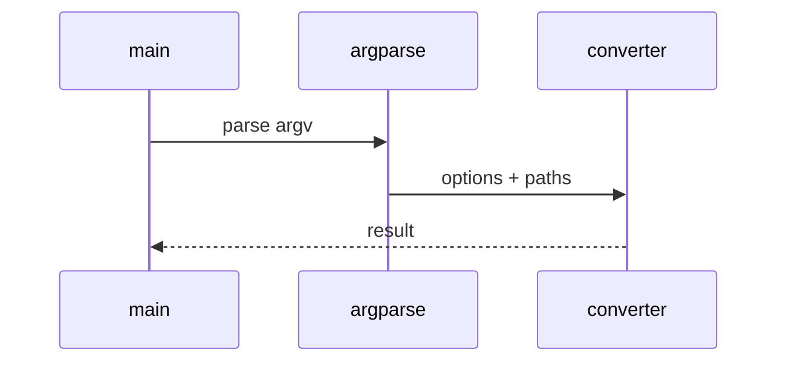

# Graph Metadata Low-Level Design

## Class and module responsibilities

| Symbol | Responsibility |
|--------|----------------|
| `extract_to_markdown` | Public entry / orchestration |
| `Neo4jAdapter` | Public entry / orchestration |
| `GraphRunConfig` | Public entry / orchestration |

## Call sequence (CLI)

## File map

| Path | Role |
|------|------|
| `src\md_generator\graph\__init__.py` | Implementation |
| `src\md_generator\graph\adapters\__init__.py` | Implementation |
| `src\md_generator\graph\adapters\factory.py` | Implementation |
| `src\md_generator\graph\adapters\neo4j_adapter.py` | Implementation |
| `src\md_generator\graph\adapters\networkx_adapter.py` | Implementation |
| `src\md_generator\graph\api\__init__.py` | Implementation |
| `src\md_generator\graph\api\main.py` | Implementation |
| `src\md_generator\graph\api\mcp_server.py` | Implementation |
| `src\md_generator\graph\api\run.py` | Implementation |
| `src\md_generator\graph\api\schemas.py` | Implementation |
| `src\md_generator\graph\api\settings.py` | Implementation |
| `src\md_generator\graph\cli\__init__.py` | Implementation |
| ... | (28 Python files total) |

Graph adapters: `graph/adapters/neo4j_adapter.py`, `networkx_adapter.py`.
