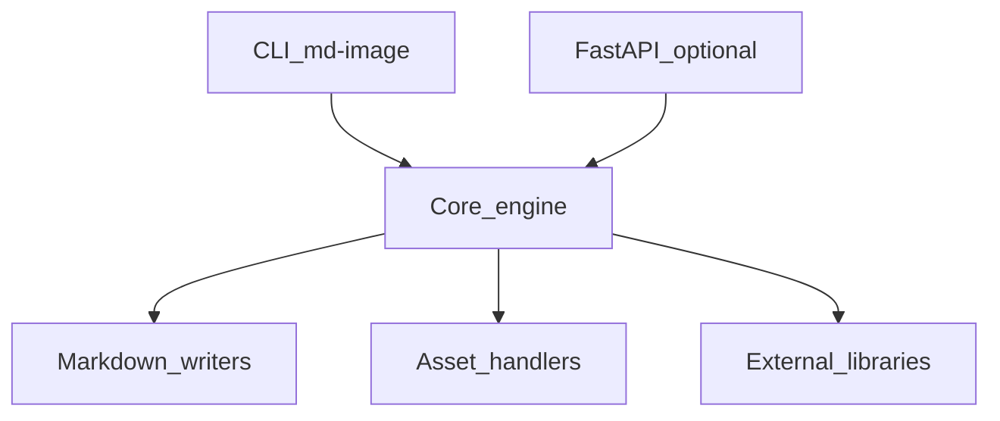
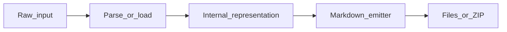

# Image OCR Architecture

## Internal layout

Source root: `src/md_generator/image` (18 Python modules detected).

Subpackages and areas: `api`, `backends`.

## Component diagram

## Dependency graph (logical)

- **Inputs:** Image files or directories
- **Outputs:** OCR Markdown and metadata
- **Optional extras:** `image or image-ocr` from `pyproject.toml`
- **Cross-module:** See `integration.md` for delegated converters and shared job patterns.

## Threading and async

- CLI runs synchronously in the invoking process.
- FastAPI routes may use background tasks or threads for long jobs.
- Domain modules (`db`, `graph`, `log`, `codeflow`) expose SSE/event streams for progress.

## Data flow

