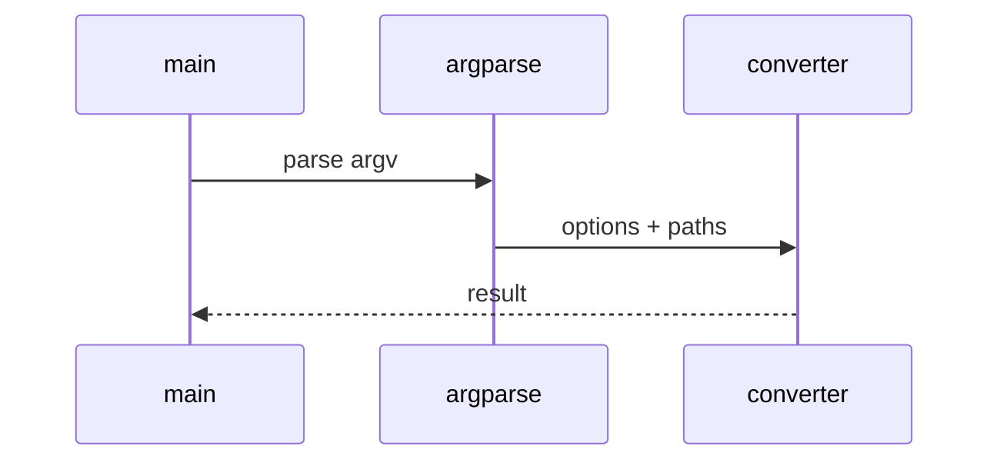

# Image OCR Low-Level Design

## Class and module responsibilities

| Symbol | Responsibility |
|--------|----------------|
| `convert_images` | Public entry / orchestration |
| `convert_images_recursive` | Public entry / orchestration |
| `build_backends` | Public entry / orchestration |

## Call sequence (CLI)

## File map

| Path | Role |
|------|------|
| `src\md_generator\image\__init__.py` | Implementation |
| `src\md_generator\image\api\__init__.py` | Implementation |
| `src\md_generator\image\api\main.py` | Implementation |
| `src\md_generator\image\api\mcp_server.py` | Implementation |
| `src\md_generator\image\api\query_options.py` | Implementation |
| `src\md_generator\image\api\settings.py` | Implementation |
| `src\md_generator\image\api\staging.py` | Implementation |
| `src\md_generator\image\api\zip_bundle.py` | Implementation |
| `src\md_generator\image\backends\__init__.py` | Implementation |
| `src\md_generator\image\backends\base.py` | Implementation |
| `src\md_generator\image\backends\easy.py` | Implementation |
| `src\md_generator\image\backends\paddle.py` | Implementation |
| ... | (18 Python files total) |

OCR backends under `image/backends/` (tesseract, paddle, easy).
