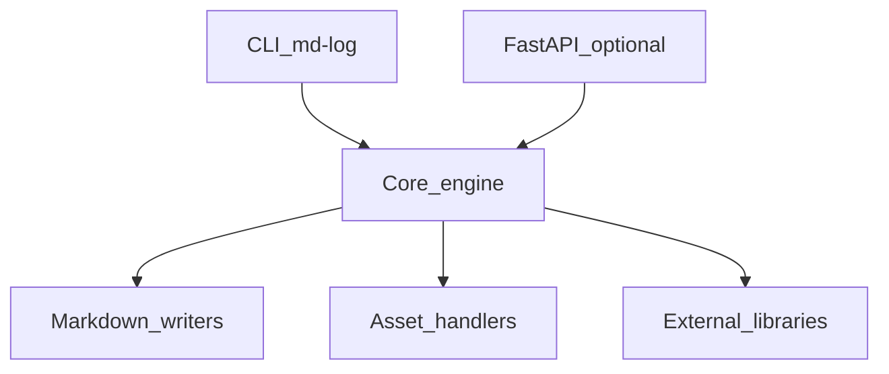
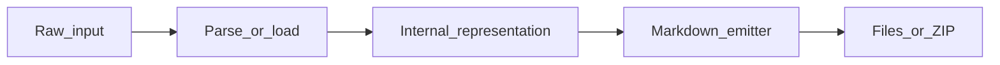

# Log Analysis Architecture

## Internal layout

Source root: `src/md_generator/log` (154 Python modules detected).

Subpackages and areas: `aggregation`, `api`, `chunking`, `cli`, `clustering`, `config`, `core`, `correlation`, `documentation`, `embeddings`, `enrichment`, `incidents`, `incremental`, `ingestion`, `intelligence`.

## Component diagram

## Dependency graph (logical)

- **Inputs:** Log files, directories, OTLP sidecars, streaming sources (tail, Kafka, Redis, websocket, stdin)
- **Outputs:** Parsed events, summaries, incidents, knowledge graph, clustering, embedding exports, incremental checkpoints
- **Optional extras:** `log` from `pyproject.toml`
- **Cross-module:** See `integration.md` for delegated converters and shared job patterns.

## Threading and async

- CLI runs synchronously in the invoking process.
- FastAPI routes may use background tasks or threads for long jobs.
- Domain modules (`db`, `graph`, `log`, `codeflow`) expose SSE/event streams for progress.

## Data flow

