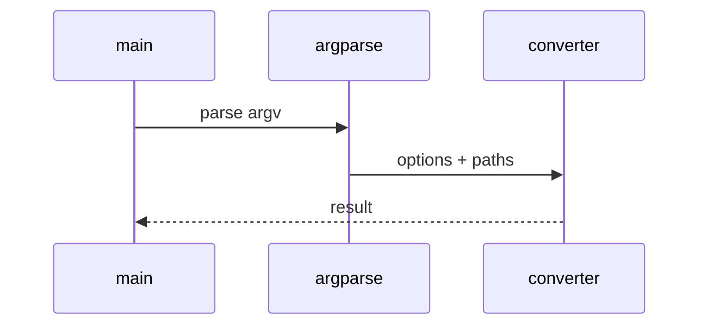

# Log Analysis Low-Level Design

## Class and module responsibilities

| Symbol | Responsibility |
|--------|----------------|
| `extract_to_markdown` | Public entry / orchestration |
| `run_pipeline` | Public entry / orchestration |
| `LogRunConfig` | Public entry / orchestration |
| `load_run_config` | Public entry / orchestration |

## Call sequence (CLI)

## File map

| Path | Role |
|------|------|
| `src\md_generator\log\__init__.py` | Implementation |
| `src\md_generator\log\aggregation\__init__.py` | Implementation |
| `src\md_generator\log\aggregation\aggregators.py` | Implementation |
| `src\md_generator\log\aggregation\dataframe_builder.py` | Implementation |
| `src\md_generator\log\aggregation\metrics.py` | Implementation |
| `src\md_generator\log\aggregation\timeline.py` | Implementation |
| `src\md_generator\log\api\__init__.py` | Implementation |
| `src\md_generator\log\api\main.py` | Implementation |
| `src\md_generator\log\api\mcp_server.py` | Implementation |
| `src\md_generator\log\api\run.py` | Implementation |
| `src\md_generator\log\api\schemas.py` | Implementation |
| `src\md_generator\log\api\settings.py` | Implementation |
| ... | (154 Python files total) |

Presets in `log/config/presets/`; pipeline stages under ingestion, parsing, clustering.
