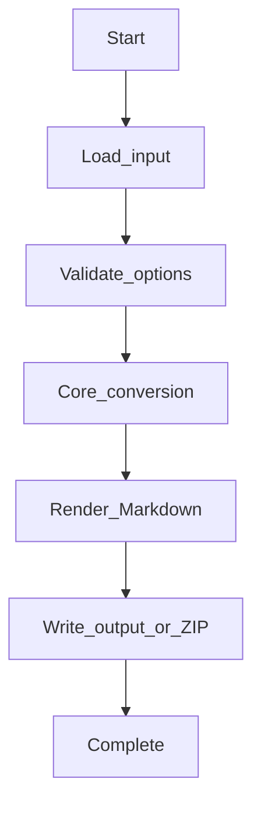
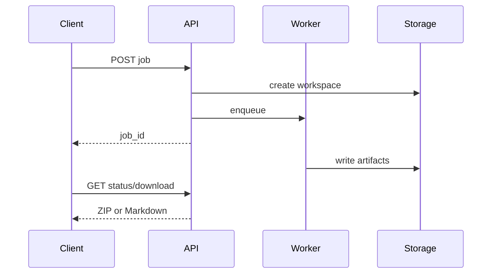
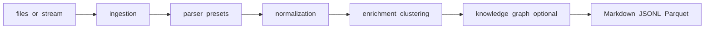

# Log Analysis Workflows

## CLI workflow

1. Install `mdengine[log]`.
2. Run `md-log --help` to list flags.
3. Provide input (Log files, directories, OTLP sidecars, streaming sources (tail, Kafka, Redis, websocket, stdin)) and output path.
4. Inspect generated Markdown and sidecar assets.

## API workflow

1. Install `mdengine[log,api]`.
2. Start uvicorn on `md_generator.log` API module (see Deployment).
3. Call sync endpoint for small payloads or job endpoint for large conversions.
4. Poll job status and download artifact when complete.

## Processing pipeline

## Async job flow

Where job routes exist, background work uses in-process threads or domain job managers; results land in job workspace + download.

## Streaming and incremental processing

- **`md-log stream`** — tail, stdin, Kafka, Redis, or websocket sources (`streaming.*` in YAML).
- **`md-log presets`** — list parser presets (generic, springboot, logback, json, …).
- **`--resume`** — incremental checkpoint resume (`incremental.*` in YAML).
- **Knowledge graph** — enable `knowledge_graph.enabled` for service/event graph Markdown + Mermaid.

