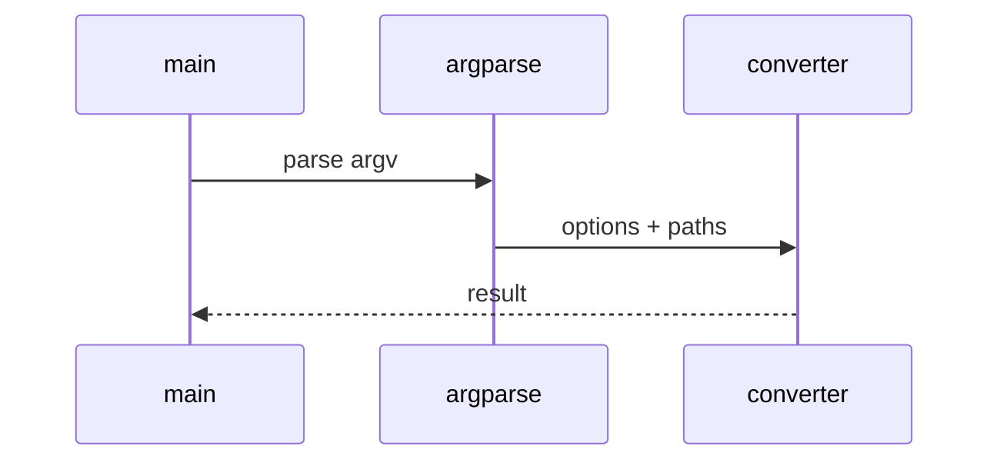

# Audio Low-Level Design

## Class and module responsibilities

| Symbol | Responsibility |
|--------|----------------|
| `DocumentConverter` | Public entry / orchestration |
| `AudioConverter` | Public entry / orchestration |

## Call sequence (CLI)

## File map

| Path | Role |
|------|------|
| `src\md_generator\media\audio\__init__.py` | Implementation |
| `src\md_generator\media\audio\api\__init__.py` | Implementation |
| `src\md_generator\media\audio\api\main.py` | Implementation |
| `src\md_generator\media\audio\api\mcp_server.py` | Implementation |
| `src\md_generator\media\audio\api\mcp_setup.py` | Implementation |
| `src\md_generator\media\audio\api\run.py` | Implementation |
| `src\md_generator\media\audio\api\settings.py` | Implementation |
| `src\md_generator\media\audio\converter.py` | Implementation |
| `src\md_generator\media\audio\formatter.py` | Implementation |
| `src\md_generator\media\audio\service.py` | Implementation |
| ... | (10 Python files total) |

