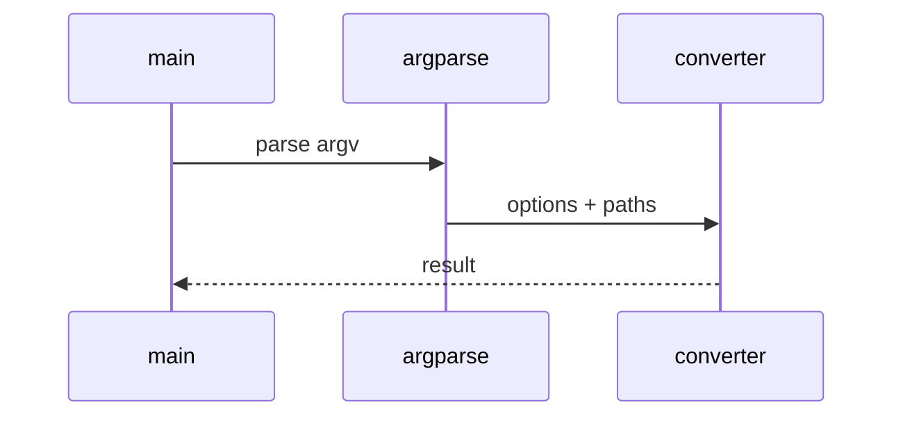

# YouTube Low-Level Design

## Class and module responsibilities

| Symbol | Responsibility |
|--------|----------------|
| `YouTubeToMarkdownService` | Public entry / orchestration |
| `YouTubeConverter` | Public entry / orchestration |

## Call sequence (CLI)

## File map

| Path | Role |
|------|------|
| `src\md_generator\media\youtube\__init__.py` | Implementation |
| `src\md_generator\media\youtube\api\__init__.py` | Implementation |
| `src\md_generator\media\youtube\api\main.py` | Implementation |
| `src\md_generator\media\youtube\api\mcp_server.py` | Implementation |
| `src\md_generator\media\youtube\api\mcp_setup.py` | Implementation |
| `src\md_generator\media\youtube\api\run.py` | Implementation |
| `src\md_generator\media\youtube\api\settings.py` | Implementation |
| `src\md_generator\media\youtube\converter.py` | Implementation |
| `src\md_generator\media\youtube\formatter.py` | Implementation |
| `src\md_generator\media\youtube\metadata.py` | Implementation |
| `src\md_generator\media\youtube\service.py` | Implementation |
| `src\md_generator\media\youtube\transcript.py` | Implementation |
| ... | (12 Python files total) |

