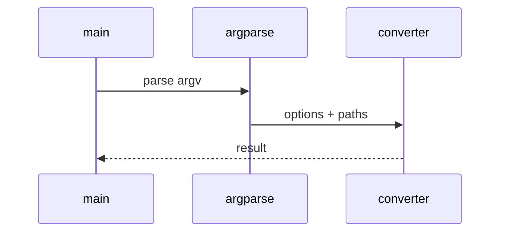

# OData Metadata Low-Level Design

## Class and module responsibilities

| Symbol | Responsibility |
|--------|----------------|
| `extract_to_markdown` | Public entry / orchestration |
| `OdataRunConfig` | Public entry / orchestration |
| `load_odata_run_config` | Public entry / orchestration |
| `build_markdown_zip_bytes` | Public entry / orchestration |

## Call sequence (CLI)

## File map

| Path | Role |
|------|------|
| `src\md_generator\odata\__init__.py` | Implementation |
| `src\md_generator\odata\api\__init__.py` | Implementation |
| `src\md_generator\odata\api\main.py` | Implementation |
| `src\md_generator\odata\api\mcp_server.py` | Implementation |
| `src\md_generator\odata\api\run.py` | Implementation |
| `src\md_generator\odata\api\schemas.py` | Implementation |
| `src\md_generator\odata\api\settings.py` | Implementation |
| `src\md_generator\odata\chunking\__init__.py` | Implementation |
| `src\md_generator\odata\chunking\strategies.py` | Implementation |
| `src\md_generator\odata\chunking\writer.py` | Implementation |
| `src\md_generator\odata\cli\__init__.py` | Implementation |
| `src\md_generator\odata\cli\main.py` | Implementation |
| ... | (46 Python files total) |

Parsers under `odata/parser/`; namespace and relationship graph in `odata/core/`.
