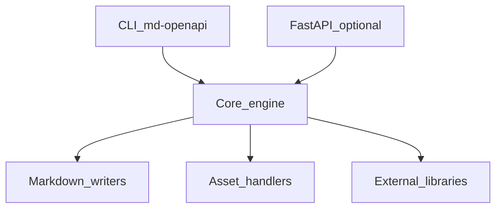

# OpenAPI Architecture

## Internal layout

Source root: `src/md_generator/openapi` (36 Python modules detected).

Subpackages and areas: `api`, `cli`, `config`, `converters`, `core`, `enrichers`, `generators`, `loaders`, `mcp`, `models`, `normalizers`, `parsers`, `resolvers`, `writers`.

## Component diagram

## Dependency graph (logical)

- **Inputs:** OpenAPI 3.x or Swagger 2.0
- **Outputs:** API documentation ZIP bundle
- **Optional extras:** `openapi` from `pyproject.toml`
- **Cross-module:** See `integration.md` for delegated converters and shared job patterns.

## Threading and async

- CLI runs synchronously in the invoking process.
- FastAPI routes may use background tasks or threads for long jobs.
- Domain modules (`db`, `graph`, `log`, `codeflow`) expose SSE/event streams for progress.

## Data flow

