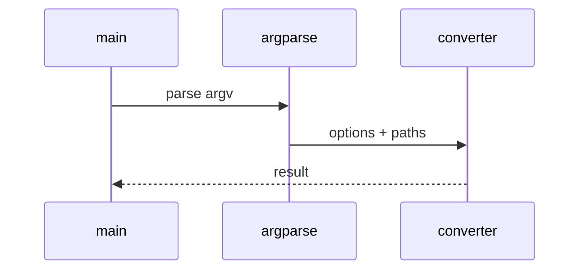

# OpenAPI Low-Level Design

## Class and module responsibilities

| Symbol | Responsibility |
|--------|----------------|
| `extract_to_markdown` | Public entry / orchestration |
| `load_spec` | Public entry / orchestration |
| `swagger2_to_openapi3` | Public entry / orchestration |

## Call sequence (CLI)

## File map

| Path | Role |
|------|------|
| `src\md_generator\openapi\__init__.py` | Implementation |
| `src\md_generator\openapi\api\__init__.py` | Implementation |
| `src\md_generator\openapi\api\main.py` | Implementation |
| `src\md_generator\openapi\api\mcp_server.py` | Implementation |
| `src\md_generator\openapi\api\run.py` | Implementation |
| `src\md_generator\openapi\api\schemas.py` | Implementation |
| `src\md_generator\openapi\api\settings.py` | Implementation |
| `src\md_generator\openapi\cli\__init__.py` | Implementation |
| `src\md_generator\openapi\cli\main.py` | Implementation |
| `src\md_generator\openapi\config\__init__.py` | Implementation |
| `src\md_generator\openapi\converters\__init__.py` | Implementation |
| `src\md_generator\openapi\converters\swagger2_to_openapi3.py` | Implementation |
| ... | (36 Python files total) |

Pipeline: loaders, parsers, resolvers, generators, writers.
