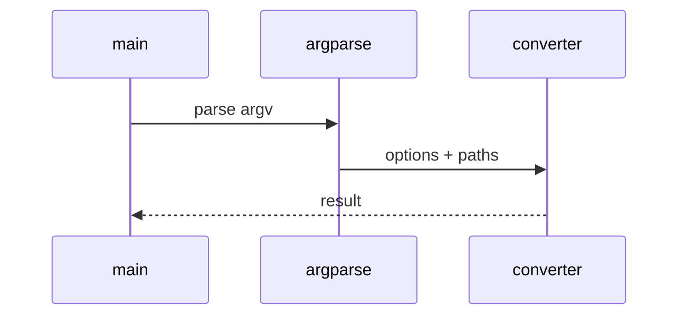

# OpenTelemetry Traces Low-Level Design

## Class and module responsibilities

| Symbol | Responsibility |
|--------|----------------|
| `load_otlp_json` | Public entry / orchestration |
| `load_otlp_bytes` | Public entry / orchestration |
| `parse_otlp_spans` | Public entry / orchestration |

## Call sequence (CLI)

## File map

| Path | Role |
|------|------|
| `src\md_generator\otel\__init__.py` | Implementation |
| `src\md_generator\otel\cli\__init__.py` | Implementation |
| `src\md_generator\otel\cli\main.py` | Implementation |
| `src\md_generator\otel\otel_logs.py` | Implementation |
| `src\md_generator\otel\otel_metrics.py` | Implementation |
| `src\md_generator\otel\otel_models.py` | Implementation |
| `src\md_generator\otel\otel_parser.py` | Implementation |
| `src\md_generator\otel\otel_spans.py` | Implementation |
| ... | (8 Python files total) |

Lightweight CLI exporter; protobuf path uses optional `log-otel-proto` extra.
