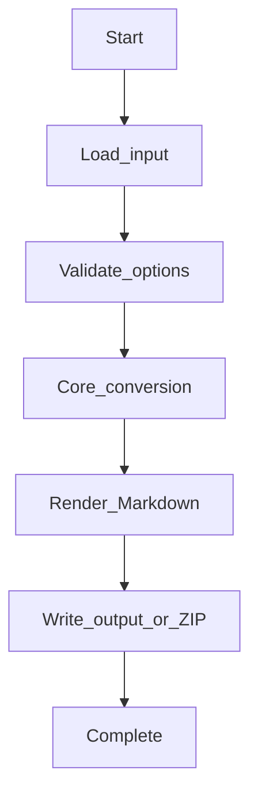
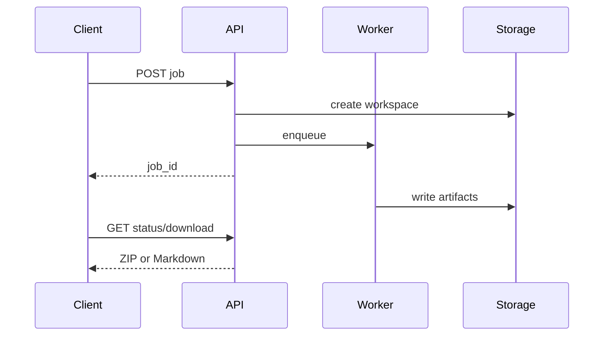

# OpenTelemetry Traces Workflows

## CLI workflow

1. Install `mdengine[log-otel-proto]`.
2. Run `md-otel --help` to list flags.
3. Provide input (OTLP JSON or protobuf trace exports) and output path.
4. Inspect generated Markdown and sidecar assets.

## API workflow

1. Install `mdengine[log-otel-proto,api]`.
2. Start uvicorn on `md_generator.otel` API module (see Deployment).
3. Call sync endpoint for small payloads or job endpoint for large conversions.
4. Poll job status and download artifact when complete.

## Processing pipeline

## Async job flow

Where job routes exist, background work uses in-process threads or domain job managers; results land in direct response.

