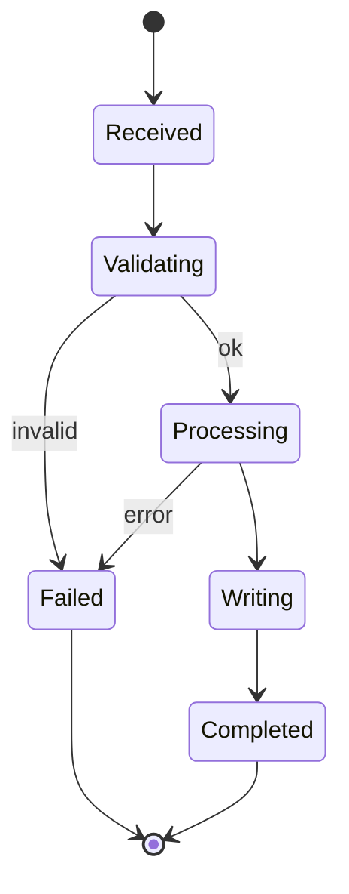

# PDF Processing Lifecycle

## States

## Phase detail

| Phase | Description |
|-------|-------------|
| Init | Parse CLI/API options; load settings/env |
| Validate | Verify paths, formats, Content-Type, upload size |
| Process | Run core conversion (`convert_pdf, convert_pdf_to_artifact_dir, ConvertOptions`) |
| Emit | Write Markdown tables/sections/assets |
| Package | Single file, artifact directory, or ZIP |
| Cleanup | Job TTL sweeper removes temp workspaces (API modules) |

## Job lifecycle (HTTP)

Job records progress from `queued` → `running` → `completed`/`failed`. Download endpoints stream ZIP bytes when ready.
