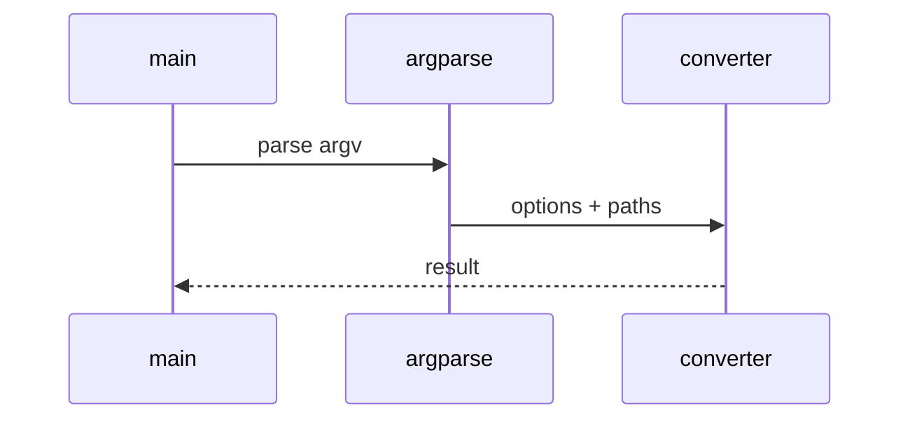

# PDF Low-Level Design

## Class and module responsibilities

| Symbol | Responsibility |
|--------|----------------|
| `convert_pdf` | Public entry / orchestration |
| `convert_pdf_to_artifact_dir` | Public entry / orchestration |
| `ConvertOptions` | Public entry / orchestration |

## Call sequence (CLI)

## File map

| Path | Role |
|------|------|
| `src\md_generator\pdf\__init__.py` | Implementation |
| `src\md_generator\pdf\api\__init__.py` | Implementation |
| `src\md_generator\pdf\api\main.py` | Implementation |
| `src\md_generator\pdf\api\mcp_server.py` | Implementation |
| `src\md_generator\pdf\api\settings.py` | Implementation |
| `src\md_generator\pdf\api\zip_bundle.py` | Implementation |
| `src\md_generator\pdf\converter.py` | Implementation |
| `src\md_generator\pdf\md_emit.py` | Implementation |
| `src\md_generator\pdf\pdf_extract.py` | Implementation |
| `src\md_generator\pdf\utils.py` | Implementation |
| ... | (10 Python files total) |

