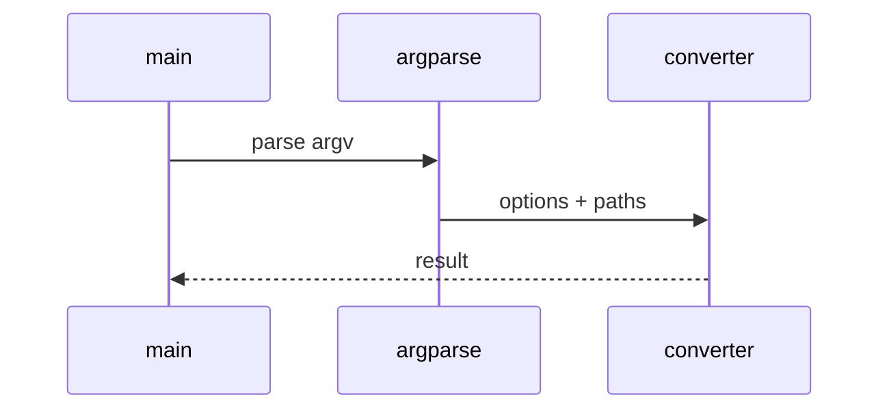

# Playwright Web Capture Low-Level Design

## Class and module responsibilities

| Symbol | Responsibility |
|--------|----------------|
| `convert_url_to_md` | Public entry / orchestration |
| `PlaywrightOptions` | Public entry / orchestration |

## Call sequence (CLI)

## File map

| Path | Role |
|------|------|
| `src\md_generator\playwright\__init__.py` | Implementation |
| `src\md_generator\playwright\api\__init__.py` | Implementation |
| `src\md_generator\playwright\api\convert_runner.py` | Implementation |
| `src\md_generator\playwright\api\jobs.py` | Implementation |
| `src\md_generator\playwright\api\main.py` | Implementation |
| `src\md_generator\playwright\api\mcp_server.py` | Implementation |
| `src\md_generator\playwright\api\mcp_setup.py` | Implementation |
| `src\md_generator\playwright\api\run.py` | Implementation |
| `src\md_generator\playwright\api\settings.py` | Implementation |
| `src\md_generator\playwright\assets.py` | Implementation |
| `src\md_generator\playwright\chunker.py` | Implementation |
| `src\md_generator\playwright\cli.py` | Implementation |
| ... | (17 Python files total) |

