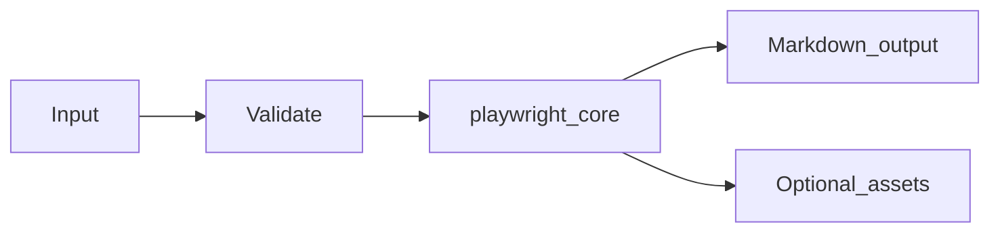

# Playwright Web Capture Module Overview

## Purpose

The **Playwright Web Capture** module (`md_generator.playwright`) converts **Rendered web pages and SPAs** into **Browser-captured Markdown**. It exists so teams can publish searchable, diff-friendly Markdown from operational inputs without maintaining separate documentation pipelines per format.

## Problem solved

- Manual copy/paste from Rendered web pages and SPAs into wikis does not scale.
- Downstream AI/RAG workflows need stable text and asset bundles.
- CI and gateways need a consistent CLI/API surface across `mdengine` modules.

## When to use

- You need repeatable Markdown export from Rendered web pages and SPAs.
- You want CLI automation, HTTP conversion, or MCP tool integration (where implemented).
- You can install the `playwright` optional extra (and `api` for HTTP services).

## When not to use

- Inputs fall outside supported formats or size limits enforced by the module.
- You require authenticated multi-tenant SaaS features (not provided by this module; use gateway auth).
- You need transactional writes into application databases (this module documents or transforms; it does not own app schemas except metadata export modules).

## Package facts

| Item | Value |
|------|-------|
| Import path | `md_generator.playwright` |
| Source tree | `src/md_generator/playwright` |
| CLI | `md-playwright` |
| PyPI extra | `playwright` |
| Complexity tier | `medium` |
| API service name | `playwright-to-md` |

## Primary entry points

- `convert_url_to_md`
- `PlaywrightOptions`

