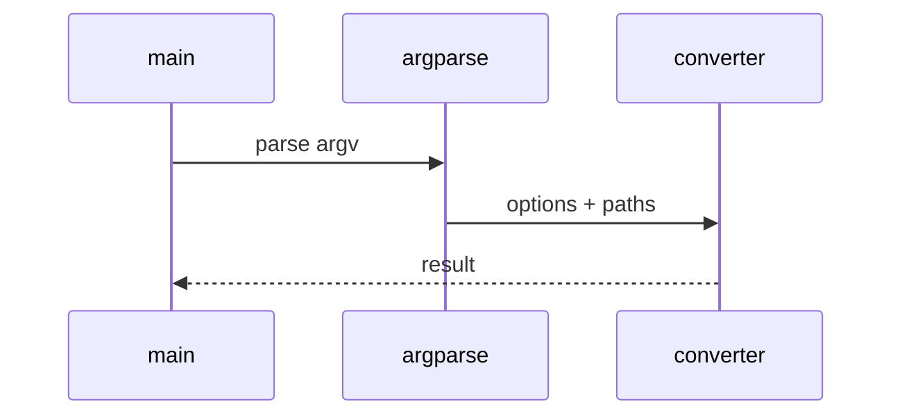

# PowerPoint Low-Level Design

## Class and module responsibilities

| Symbol | Responsibility |
|--------|----------------|
| `convert_pptx` | Public entry / orchestration |
| `ConvertOptions` | Public entry / orchestration |
| `build_artifact_zip_bytes` | Public entry / orchestration |

## Call sequence (CLI)

## File map

| Path | Role |
|------|------|
| `src\md_generator\ppt\__init__.py` | Implementation |
| `src\md_generator\ppt\api\__init__.py` | Implementation |
| `src\md_generator\ppt\api\convert_runner.py` | Implementation |
| `src\md_generator\ppt\api\jobs.py` | Implementation |
| `src\md_generator\ppt\api\main.py` | Implementation |
| `src\md_generator\ppt\api\mcp_server.py` | Implementation |
| `src\md_generator\ppt\api\mcp_setup.py` | Implementation |
| `src\md_generator\ppt\api\query_options.py` | Implementation |
| `src\md_generator\ppt\api\settings.py` | Implementation |
| `src\md_generator\ppt\convert_impl.py` | Implementation |
| `src\md_generator\ppt\converter.py` | Implementation |
| `src\md_generator\ppt\embedded_extract.py` | Implementation |
| ... | (21 Python files total) |

