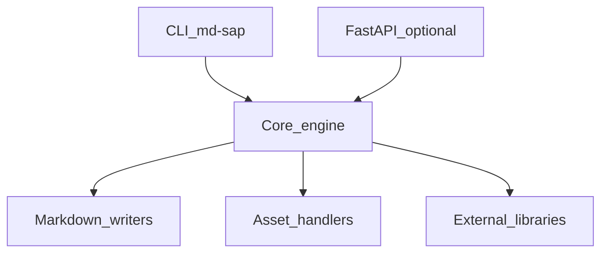

# SAP Intelligence Architecture

## Internal layout

Source root: `src/md_generator/sap` (190 Python modules detected).

Subpackages and areas: `analyzer`, `api`, `canonical`, `chunking`, `cli`, `core`, `framework`, `generators`, `graph`, `index`, `lineage`, `markdown`, `models`, `normalizer`, `orchestration`.

## Component diagram

## Dependency graph (logical)

- **Inputs:** ABAP, CDS/DDL, DDIC (ADT XML, abapGit `.tabl.xml`), HANA CV exports, BW, Datasphere, OData $metadata, BAPI, IDoc, transport files
- **Outputs:** Canonical JSON, per-artifact Markdown (DDIC/HANA/CDS/ABAP), lineage/impact graphs, semantic narrative, cross-linked knowledge packs, optional chunks
- **Optional extras:** `sap` from `pyproject.toml`
- **Cross-module:** See `integration.md` for delegated converters and shared job patterns.

## Threading and async

- CLI runs synchronously in the invoking process.
- FastAPI routes may use background tasks or threads for long jobs.
- Domain modules (`db`, `graph`, `log`, `codeflow`) expose SSE/event streams for progress.

## Data flow

