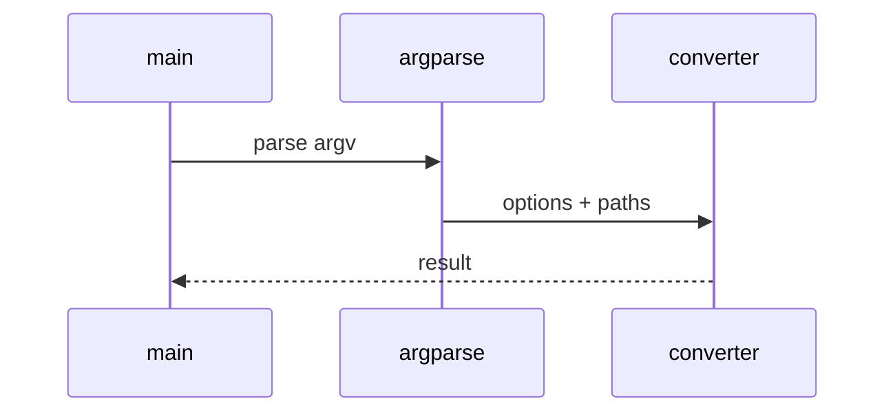

# SAP Intelligence Low-Level Design

## Class and module responsibilities

| Symbol | Responsibility |
|--------|----------------|
| `extract_to_markdown` | Public entry / orchestration |
| `SapRunConfig` | Public entry / orchestration |
| `load_run_config` | Public entry / orchestration |
| `SapJobManager` | Public entry / orchestration |

## Call sequence (CLI)

## File map

| Path | Role |
|------|------|
| `src\md_generator\sap\__init__.py` | Implementation |
| `src\md_generator\sap\analyzer\authorization\extractor.py` | Implementation |
| `src\md_generator\sap\analyzer\governance\classifier.py` | Implementation |
| `src\md_generator\sap\analyzer\lineage\builder.py` | Implementation |
| `src\md_generator\sap\analyzer\relationships\engine.py` | Implementation |
| `src\md_generator\sap\analyzer\semantics\entity_mapper.py` | Implementation |
| `src\md_generator\sap\analyzer\validation\extractor.py` | Implementation |
| `src\md_generator\sap\api\main.py` | Implementation |
| `src\md_generator\sap\api\mcp_server.py` | Implementation |
| `src\md_generator\sap\api\run.py` | Implementation |
| `src\md_generator\sap\api\schemas.py` | Implementation |
| `src\md_generator\sap\api\settings.py` | Implementation |
| ... | (190 Python files total) |

Parser plugins via YAML `parser.plugins`; generators registered in `sap/generators/registry.py`.
