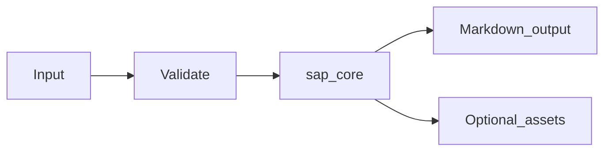

# SAP Intelligence Module Overview

## Purpose

The **SAP Intelligence** module (`md_generator.sap`) converts **ABAP, CDS/DDL, DDIC (ADT XML, abapGit `.tabl.xml`), HANA CV exports, BW, Datasphere, OData $metadata, BAPI, IDoc, transport files** into **Canonical JSON, per-artifact Markdown (DDIC/HANA/CDS/ABAP), lineage/impact graphs, semantic narrative, cross-linked knowledge packs, optional chunks**. It exists so teams can publish searchable, diff-friendly Markdown from operational inputs without maintaining separate documentation pipelines per format.

## Problem solved

- Manual copy/paste from ABAP, CDS/DDL, DDIC (ADT XML, abapGit `.tabl.xml`), HANA CV exports, BW, Datasphere, OData $metadata, BAPI, IDoc, transport files into wikis does not scale.
- Downstream AI/RAG workflows need stable text and asset bundles.
- CI and gateways need a consistent CLI/API surface across `mdengine` modules.

## When to use

- You need repeatable Markdown export from ABAP, CDS/DDL, DDIC (ADT XML, abapGit `.tabl.xml`), HANA CV exports, BW, Datasphere, OData $metadata, BAPI, IDoc, transport files.
- You want CLI automation, HTTP conversion, or MCP tool integration (where implemented).
- You can install the `sap` optional extra (and `api` for HTTP services).

## When not to use

- Inputs fall outside supported formats or size limits enforced by the module.
- You require authenticated multi-tenant SaaS features (not provided by this module; use gateway auth).
- You need transactional writes into application databases (this module documents or transforms; it does not own app schemas except metadata export modules).

## Package facts

| Item | Value |
|------|-------|
| Import path | `md_generator.sap` |
| Source tree | `src/md_generator/sap` |
| CLI | `md-sap` |
| Alternate CLI | `mdengine sap-to-md` |
| PyPI extra | `sap` |
| Complexity tier | `complex` |
| API service name | `sap-to-md` |

## Primary entry points

- `extract_to_markdown`
- `SapRunConfig`
- `load_run_config`
- `SapJobManager`
- `format_semantic_narrative`

