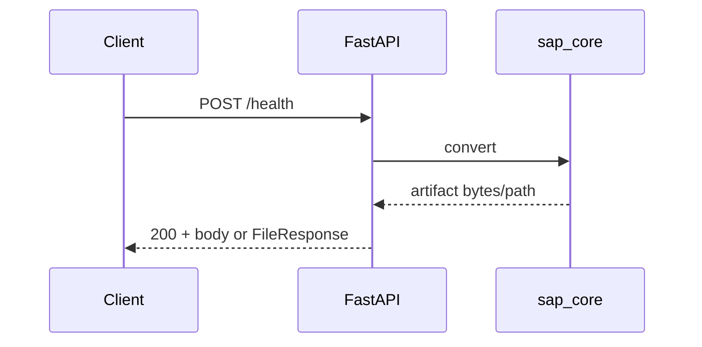
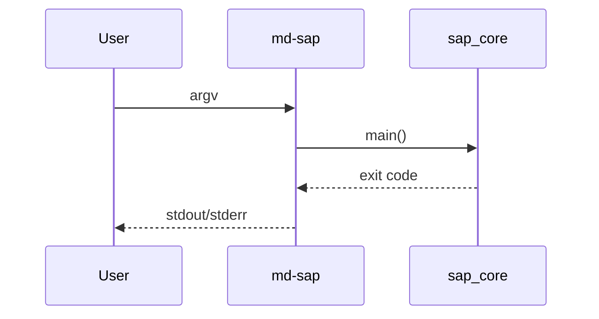

# SAP Intelligence Sequence Diagrams

## Synchronous HTTP conversion

```mermaid
sequenceDiagram
    participant Client
    participant API as FastAPI
    participant Core as sap_core
    Client->>API: POST /health
    API->>Core: convert
    Core-->>API: artifact bytes/path
    API-->>Client: 200 + body or FileResponse
```

## CLI invocation

```mermaid
sequenceDiagram
    participant User
    participant CLI as md-sap
    participant Core as sap_core
    User->>CLI: argv
    CLI->>Core: main()
    Core-->>CLI: exit code
    CLI-->>User: stdout/stderr
```
