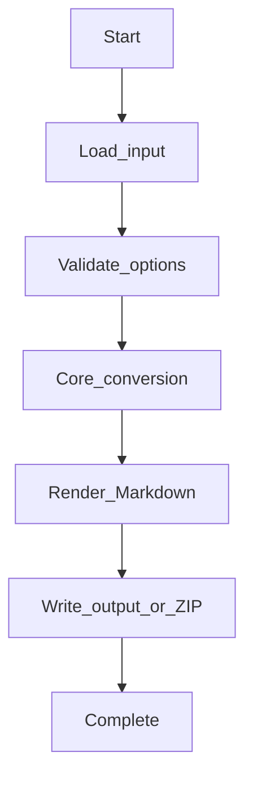
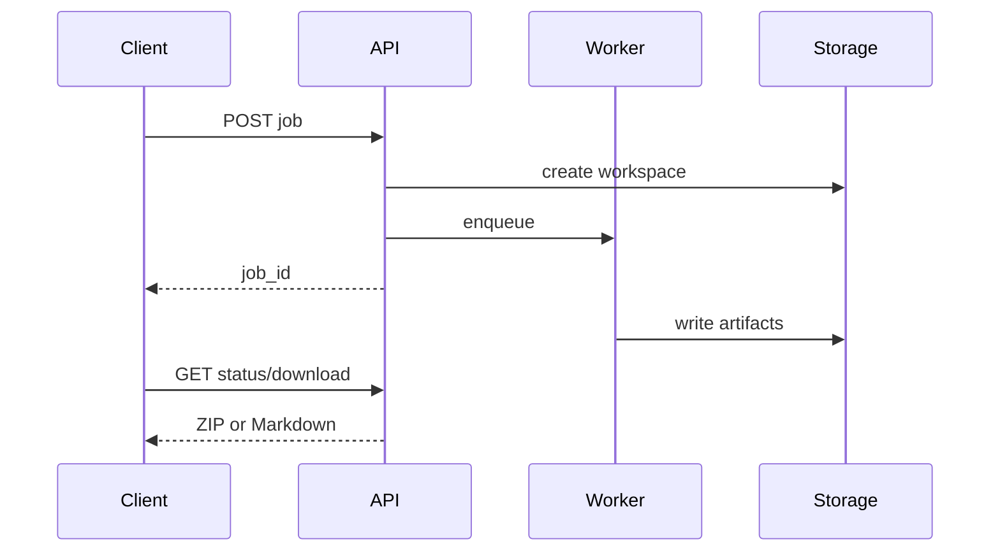
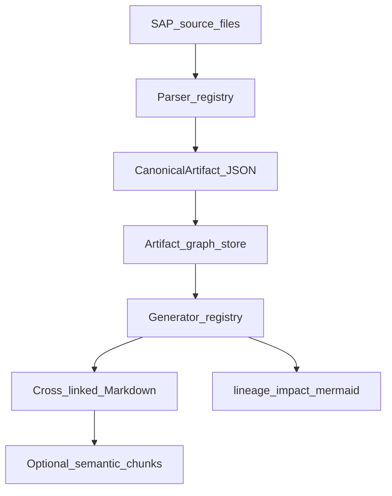

# SAP Intelligence Workflows

## CLI workflow

1. Install `mdengine[sap]`.
2. Run `md-sap --help` to list flags.
3. Provide input (ABAP, CDS/DDL, DDIC (ADT XML, abapGit `.tabl.xml`), HANA CV exports, BW, Datasphere, OData $metadata, BAPI, IDoc, transport files) and output path.
4. Inspect generated Markdown and sidecar assets.

## API workflow

1. Install `mdengine[sap,api]`.
2. Start uvicorn on `md_generator.sap` API module (see Deployment).
3. Call sync endpoint for small payloads or job endpoint for large conversions.
4. Poll job status and download artifact when complete.

## Processing pipeline

## Async job flow

Where job routes exist, background work uses in-process threads or domain job managers; results land in job workspace + download.

## SAP pipeline (v1 vs v2)

- **Pipeline v1** — legacy entity builder path.
- **Pipeline v2** — canonical JSON + artifact graph + registered generators (`--pipeline-version 2` or `pipeline.version: 2` in YAML).
- Enable **semantic narrative** (deterministic, no LLM) with `pipeline.semantic_narrative: true`.

## Feature flags (`--include` / `--exclude`)

Supported values: `authorization`, `chunks`, `entities`, `functional`, `governance`, `graphs`, `json_output`, `lineage`, `odata_catalog`, `relationships`, `technical`, `validations`.

