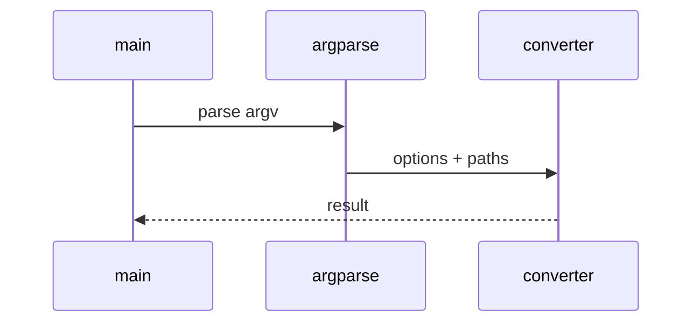

# Text JSON XML Low-Level Design

## Class and module responsibilities

| Symbol | Responsibility |
|--------|----------------|
| `convert_text_file` | Public entry / orchestration |
| `json_to_markdown` | Public entry / orchestration |
| `xml_to_markdown` | Public entry / orchestration |
| `detect_format` | Public entry / orchestration |

## Call sequence (CLI)

## File map

| Path | Role |
|------|------|
| `src\md_generator\text\__init__.py` | Implementation |
| `src\md_generator\text\api\__init__.py` | Implementation |
| `src\md_generator\text\api\convert_runner.py` | Implementation |
| `src\md_generator\text\api\jobs.py` | Implementation |
| `src\md_generator\text\api\main.py` | Implementation |
| `src\md_generator\text\api\mcp_server.py` | Implementation |
| `src\md_generator\text\api\mcp_setup.py` | Implementation |
| `src\md_generator\text\api\query_options.py` | Implementation |
| `src\md_generator\text\api\settings.py` | Implementation |
| `src\md_generator\text\convert_impl.py` | Implementation |
| `src\md_generator\text\converter.py` | Implementation |
| `src\md_generator\text\format_detect.py` | Implementation |
| ... | (18 Python files total) |

