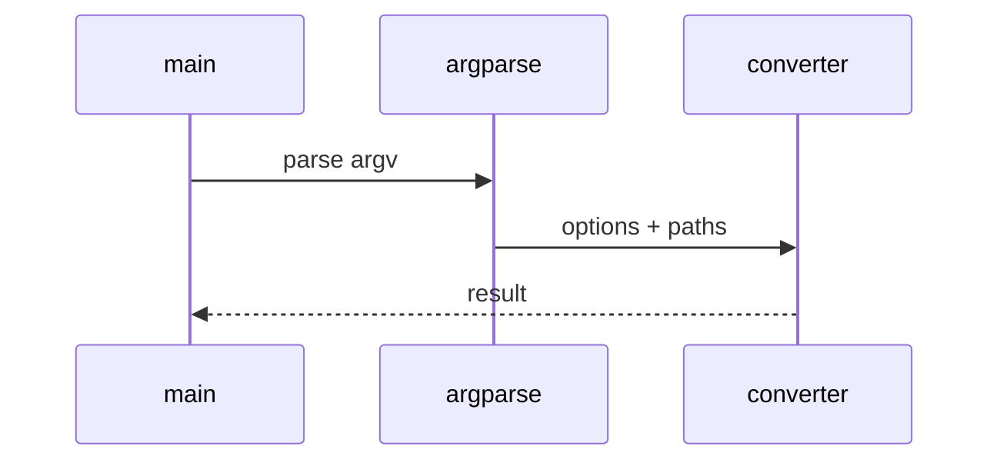

# AI Assistant Tools Low-Level Design

## Class and module responsibilities

| Symbol | Responsibility |
|--------|----------------|
| `Registry` | Public entry / orchestration |
| `MasterAgent` | Public entry / orchestration |
| `run_assist` | Public entry / orchestration |
| `run_export` | Public entry / orchestration |

## Call sequence (CLI)

## File map

| Path | Role |
|------|------|
| `src\md_generator\tools\assistant\__init__.py` | Implementation |
| `src\md_generator\tools\assistant\adapters\__init__.py` | Implementation |
| `src\md_generator\tools\assistant\adapters\claude.py` | Implementation |
| `src\md_generator\tools\assistant\adapters\cursor.py` | Implementation |
| `src\md_generator\tools\assistant\adapters\openai.py` | Implementation |
| `src\md_generator\tools\assistant\agent.py` | Implementation |
| `src\md_generator\tools\assistant\bundle.py` | Implementation |
| `src\md_generator\tools\assistant\chunks.py` | Implementation |
| `src\md_generator\tools\assistant\cli.py` | Implementation |
| `src\md_generator\tools\assistant\rag.py` | Implementation |
| `src\md_generator\tools\assistant\registry.py` | Implementation |
| ... | (11 Python files total) |

