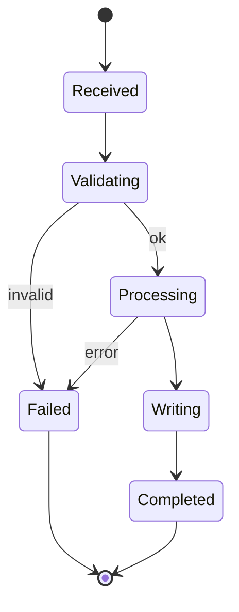

# Skill Builder Processing Lifecycle

## States

## Phase detail

| Phase | Description |
|-------|-------------|
| Init | Parse CLI/API options; load settings/env |
| Validate | Verify paths, formats, Content-Type, upload size |
| Process | Run core conversion (`run_generate, build_dependency_graph, build_routing_block`) |
| Emit | Write Markdown tables/sections/assets |
| Package | Single file, artifact directory, or ZIP |
| Cleanup | Job TTL sweeper removes temp workspaces (API modules) |

## Job lifecycle (HTTP)

This module primarily uses synchronous CLI/API responses without a job store.
