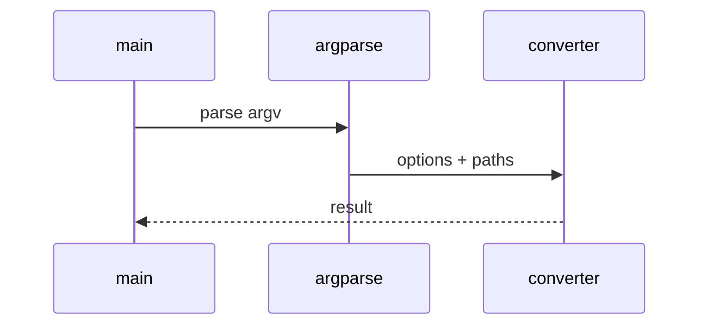

# Skill Builder Low-Level Design

## Class and module responsibilities

| Symbol | Responsibility |
|--------|----------------|
| `run_generate` | Public entry / orchestration |
| `build_dependency_graph` | Public entry / orchestration |
| `build_routing_block` | Public entry / orchestration |

## Call sequence (CLI)

## File map

| Path | Role |
|------|------|
| `src\md_generator\tools\skill_builder\__init__.py` | Implementation |
| `src\md_generator\tools\skill_builder\__main__.py` | Implementation |
| `src\md_generator\tools\skill_builder\dependency_graph.py` | Implementation |
| `src\md_generator\tools\skill_builder\generate.py` | Implementation |
| `src\md_generator\tools\skill_builder\pyproject_util.py` | Implementation |
| `src\md_generator\tools\skill_builder\routing.py` | Implementation |
| ... | (6 Python files total) |

