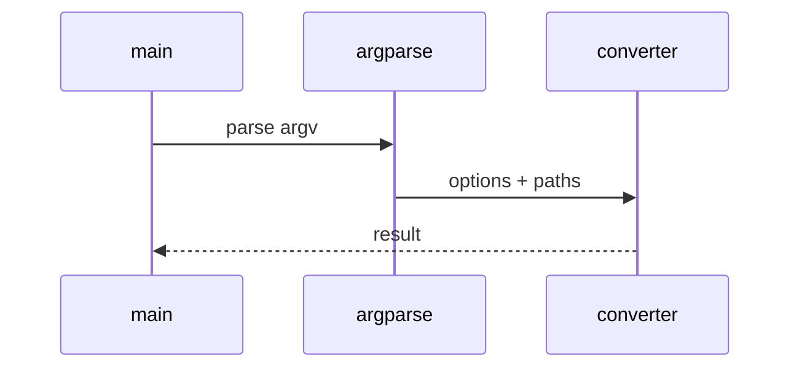

# Word Low-Level Design

## Class and module responsibilities

| Symbol | Responsibility |
|--------|----------------|
| `convert_docx_to_markdown` | Public entry / orchestration |
| `WordToMdSettings` | Public entry / orchestration |

## Call sequence (CLI)

## File map

| Path | Role |
|------|------|
| `src\md_generator\word\__init__.py` | Implementation |
| `src\md_generator\word\api\__init__.py` | Implementation |
| `src\md_generator\word\api\convert_util.py` | Implementation |
| `src\md_generator\word\api\jobs.py` | Implementation |
| `src\md_generator\word\api\main.py` | Implementation |
| `src\md_generator\word\api\mcp_server.py` | Implementation |
| `src\md_generator\word\artifact.py` | Implementation |
| `src\md_generator\word\converter.py` | Implementation |
| `src\md_generator\word\settings.py` | Implementation |
| ... | (9 Python files total) |

