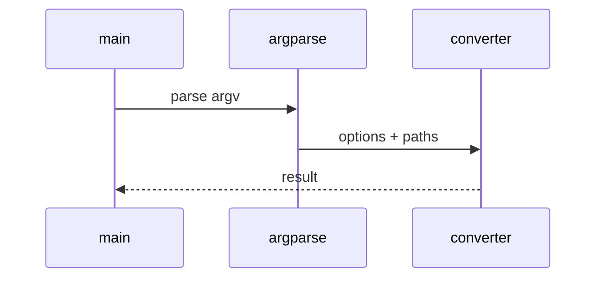

# Excel and CSV Low-Level Design

## Class and module responsibilities

| Symbol | Responsibility |
|--------|----------------|
| `convert_excel_to_markdown` | Public entry / orchestration |
| `ConvertConfig` | Public entry / orchestration |

## Call sequence (CLI)

## File map

| Path | Role |
|------|------|
| `src\md_generator\xlsx\__init__.py` | Implementation |
| `src\md_generator\xlsx\api\__init__.py` | Implementation |
| `src\md_generator\xlsx\api\app.py` | Implementation |
| `src\md_generator\xlsx\convert_config.py` | Implementation |
| `src\md_generator\xlsx\converter.py` | Implementation |
| `src\md_generator\xlsx\converter_core.py` | Implementation |
| `src\md_generator\xlsx\excel_reader.py` | Implementation |
| `src\md_generator\xlsx\markdown_emitter.py` | Implementation |
| `src\md_generator\xlsx\mcp_server.py` | Implementation |
| ... | (9 Python files total) |

